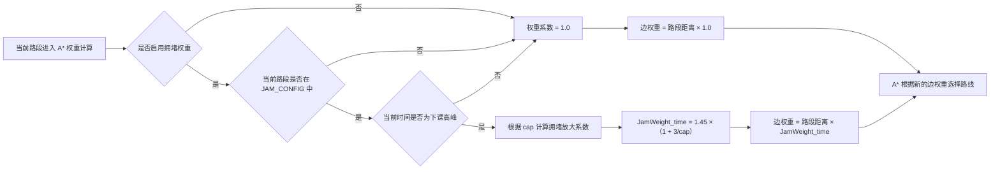
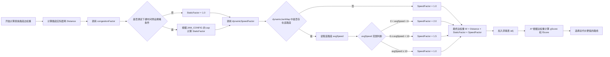

校园共享单车导航项目前端程序
待实现功能 
1.增加停车是否在停车区域判定（已完成）
2.个人登录界面（已完成）
3.个人界面查看历史骑行记录功能（已完成）
4.管理员身份单车调度功能（已完成）
5.路线选择导航实时指示功能（已完成）
6.拥堵路线判定加入单车用户， 单车速度辅助判断
7.用户上报单车故障， 管理员维修(已完成)
8.拥堵路线时间计算增加参数

数据与区域补充
1.路点扩充（已完成）
2.停车区域增加（已完成）
3.增加在停车点内的单车数量（已完成）
4.增加快捷地标点（已完成）

细节修改
1.上下课堵塞时间改为真实时间
2.优化拆分代码

